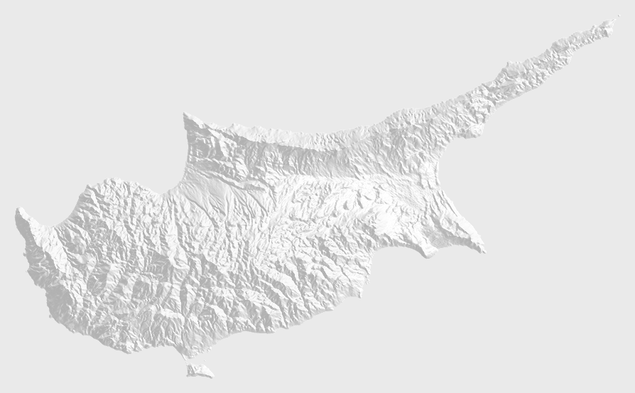
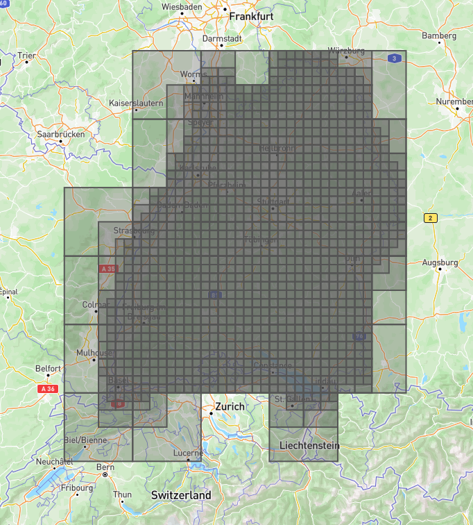

# Generate WebMercator Tiles from SRTM Altitude Data

[](https://doi.org/10.5281/zenodo.10518201)
[](https://doi.org/10.18419/darus-3837)


This repository contains the code to generate WebMercator "slippy map" tiles containing only hillshading from the SRTM altitude data provided by NASA.
Such tiles can be useful, for example, in cases where the map material used cannot include political borders or infrastructure (e.g., for historical maps), and the use of commercial map material (e.g., Mapbox) is not an option.
The map tiles generated from this code are available up to zoom level 12, published under the Creative Commons [CC BY 4.0](https://creativecommons.org/licenses/by/4.0/) license on the long-term data repository of the University of Stuttgart (DaRUS), [here](https://darus.uni-stuttgart.de/dataset.xhtml?persistentId=doi%3A10.18419%2Fdarus-3837).

<figure>
  
  <figcaption id="teaser-caption">
    Teaser: The hillshades of Cyprus on zoom level 9.
  </figcaption>
<figure>


## Getting the Raw Data

The raw SRTM data can be downloaded from [NASA](https://doi.org/10.5067/MEaSUREs/SRTM/SRTMGL1.003).
To do this, you will need to register a free EOSDIS Earthdata account.
Then, you can download all tiles [here](https://search.earthdata.nasa.gov/search/granules?p=C1000000240-LPDAAC_ECS&pg[0][v]=f&pg[0][gsk]=-start_date&q=SRTM&tl=1701254125!3!!).
Alternatively, you can use the download script ([data/download.sh](data/download.sh)) directly.

The SRTM data is available to the precision of one arcsecond.
Hence, the total width of the measured image is 360 * 3600px = 1296000px.
On zoom level 0, the entire earth fits into 256x256 pixels.
Consequently, the maximum zoom level possible to generate from the SRTM data, without undersampling, is floor(log2(1296000 / 256)) = 12, which is a reasonable zoom level.


## Commands

Install requirements using Poetry:

``` bash
$ poetry install
```

Additional information about the subcommands can be obtained from the `argparse` help and usage message:

``` bash
$ poetry run python -m generate_tiles -h
$ poetry run python -m generate_tiles subcommand -h
```

### `generate-tiles`

This subcommand generates the PNG tiles themselves.
By default, all tiles from level 0 to 12 are generated, within a directory `tiles/` under the current working directory;
all these values can be changed via command-line arguments.
The file `empties.txt.gz` must exist in the current directory.
The tiles listed in that file (see [`generate-empties`](#generate-empties)) are skipped.


### `generate-empties`

This subcommand generates a list of tiles that are empty.
These tiles show completely flat areas, which occur on water and outside the latitude ranges covered by the SRTM data (north of N&thinsp;60&deg;, south of S&thinsp;60&deg;).
They will not be generated or stored, thereby saving computing time and storage space.
The list is saved as a GZIP-compressed text file, in which each line lists one empty tile.

The subcommand optionally takes arguments to change the minimum and maximum tile zoom level to generate the tiles from (default: 0 to 12), as well as the file to write the result to (default: `empties.txt.gz`).
A GeoJSON file containing the landmasses as `Polygon` and `MultiPolygon` `Feature`s (either as one `Feature`, or as a `FeatureCollection`) must be passed.
This is used to determine which tiles are empty without generating the tiles themselves first.


### `generate-archive`

This subcommand generates the shell commands necessary to generate the ZIP archives and metadata necessary to upload the generated tiles to DaRUS in an efficient manner, as well as the actual upload commands.
The maximum tile level (default: 12) can optionally be passed.
The minimum tile level is assumed to be zero.

This subcommand outputs a number of files:

- `manifest.txt`: A file containing a list of non-empty tiles contained in the individual ZIP archives. The archives are split up as follows:
  - All tiles from levels 0 to 5 are contained in a single archive.
  - All tiles of level N (N&ge;6) are grouped by their parent WebMercator tile of level N-6; that is, all tiles of level 6 are contained in one archive (group level 0), tiles of level 7 are contained in four archives (group level 1, indices 0/0 to 1/1), and so on.
- `archive/XXX.contents`: A file containing a list of tile files to include in the archive `XXX`.
- `archive/XXX.metadata`: A file containing the DaRUS metadata to be attached to the archive `XXX` during upload.
- `archive_commands`: A list of bash commands that doubly[^doubly] ZIP-compresses a group of tile files.
- `upload_commands`: A list of bash commands that uploads all generated ZIP files, alongside their metadata, to DaRUS.

The `*_commands` files can be inspected, and the variables at the top might need to be changed.
Afterwards, the files can be passed as arguments to `bash`.
The `archive_commands` should be executed first.


[^doubly]: Because DaRUS extracts ZIP files on upload, the ZIP files are ZIP-ed again.


### `generate-download`

This subcommand generates the shell commands necessary to download, extract, and use the tiles already uploaded to DaRUS.
**This is probably the only subcommand you will need.**
Optionally, the base URL to the DaRUS instance, and the `persistentId` of the dataset, can be changed.
In addition, a DaRUS API token can be configured.
This should not be required for a published (i.e., public) DaRUS repository.

In addition, the subcommand may be passed a GeoJSON file containing one or more `Polygon`s and `MultiPolygons`.
In that case, a maximum tile zoom level inside and outside the `Feature`s can be configured as well.
As a result, tiles completely outside the `Feature`s will only be downloaded until a certain zoom level, whereas tiles overlapping the `Feature`s can be downloaded with a higher level of detail (see figure below for an example).
This can save space if detail is only required for a smaller area;
as an example, covering the area of the Middle East down to zoom level 12, but the rest of the world only to zoom level 6, takes up approximately 9.2GB of storage space, whereas the full dataset of tiles until zoom level 12 requires about 103GB of storage space (2.6M tiles).

This subcommand outputs a number of files:

- `download_commands`: A list of bash commands that download the required files from the DaRUS repository.
- `extraction_commands`: A list of bash commands that extract the tiles from the ZIP files.
- `softlink_commands`: A list of bash commands that softlink (`ln -s`) the empty tile file to all places in the slippy map tile hierarchy where it is needed.
- `leaflet_code.js`: A JavaScript snippet of how to include the tiles in a [Leaflet.js](https://leafletjs.com/) map. The maximum zoom level, as well as the optional GeoJSON restriction shape, are considered to produce a sensible map.

For the `*_commands`, some variables can be changed at the top of each file.
Some variables need to be changed consistently across the files.
The files should be executed by `bash` in the order given in the list above.

<figure>
  
  <figcaption id="bw-caption">
    Example for a restricted tile download, where a GeoJSON `Polygon` of the outline of the German state of Baden-Württemberg was used.
    Tiles that intersect with the outline and have a zoom level between 8 and 11 are shown.
    Screenshot from <a href="http://geojson.io">geojson.io</a>.
    Map data &copy; Mapbox &copy; OpenStreetMap.
  </figcaption>
<figure>
